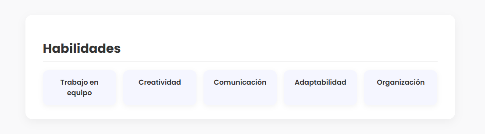

# CV React Dinámico Interactivo - Ximena Roldán García

## Descripción del Proyecto

Este proyecto es un **CV dinámico construido con React y Vite** que permite interactuar con la información del perfil, experiencia, estudios y stack tecnológico.
Se implementaron **eventos y estado local** (`useState`) para hacer el CV **interactivo y personalizable**, permitiendo:

* Mostrar u ocultar las habilidades con un botón.
* Agregar nuevas tecnologías al stack mediante un formulario controlado.
* Renderizado dinámico de tecnologías y habilidades según el estado actual.

---

## Funcionalidades principales

1. **Mostrar/Ocultar Habilidades**

   * Componente: `ToggleHabilidades.jsx`
   * Botón que permite mostrar u ocultar el componente `Habilidades`.
   * Implementa `useState` y renderizado condicional.
   * Event handler: `onClick` para cambiar el estado.

2. **Agregar Tecnologías al Stack**

   * Componente: `FormularioTecnologia.jsx`
   * Formulario controlado que permite agregar nuevas tecnologías a la categoría seleccionada.
   * Evita recargar la página usando `event.preventDefault()`.
   * Actualiza el estado en `App.jsx` mediante una función pasada como prop (`agregarTecnologia`).
   * Inputs manejados con `useState` y eventos `onChange`.

3. **Stack Tecnológico Dinámico**

   * Componente: `StackTecnologias.jsx`
   * Renderiza automáticamente las tecnologías según el estado global de `App.jsx`.
   * Permite que se actualicen dinámicamente al agregar nuevas tecnologías.

---

## Estructura del Proyecto

```
src/
├── App.jsx
├── App.css
├── data/
│   └── cvData.js
├── Cabecera.jsx
├── Perfil.jsx
├── Experiencia.jsx
├── Estudios.jsx
├── StackTecnologias.jsx
├── Habilidades.jsx
├── ToggleHabilidades.jsx
├── FormularioTecnologia.jsx
public/
└── img/perfil.jpeg
```

---

## Capturas de Pantalla




---

## Instrucciones para ejecutar el proyecto

1. Clona el repositorio:

```bash
git clone https://github.com/Ximena0405/cv-react-ximena.git
cd cv-react-ximena
```

2. Instala dependencias:

```bash
npm install
```

3. Ejecuta la aplicación:

```bash
npm run dev
```

4. Abre en tu navegador la URL que te muestra Vite (normalmente `http://localhost:5173`).

---

## Historial de Commits y Componentes

### 20 de Noviembre de 2025

* Inicio de carpeta y documentación con dependencias de React y Vite - `8481e65`
* feat: agrega componente Perfil y actualiza App - `0030ba6`
* feat: agregar componente Experiencia e integrarlo en App - `95536b8`

### 21 de Noviembre de 2025

* feat: agregar componente Estudios e integrarlo en App - `62c3f12`

### 24 de Noviembre de 2025

* feat: componente StackTecnologias dinámico y con renderizado - `b77c698`
* feat: actualizar estilos de cabecera para diseño más elegante y minimalista - `92b4569`

### 25 de Noviembre de 2025

* feat: creación de componente ToggleHabilidades con renderizado condicional - (commit local)
* feat: creación de componente FormularioTecnologia y renderizado dinámico de tecnologías - (commit local)

---

## Conceptos Aplicados

* **useState**: Mantener y actualizar el estado de tecnologías y visibilidad de habilidades.
* **Props y Callback Functions**: Pasar funciones desde `App.jsx` a componentes hijos para actualizar el estado global.
* **Eventos**: `onClick`, `onChange`, `onSubmit` para la interacción del usuario.
* **Renderizado Condicional**: Mostrar u ocultar componentes dinámicamente según el estado.
* **Formularios Controlados**: Inputs manejados por `useState` y actualizados dinámicamente.

---

## Autor

**Ximena Roldán García**
Estudiante de Programación
[ximenaroldan367@gmail.com](mailto:ximenaroldan367@gmail.com)
