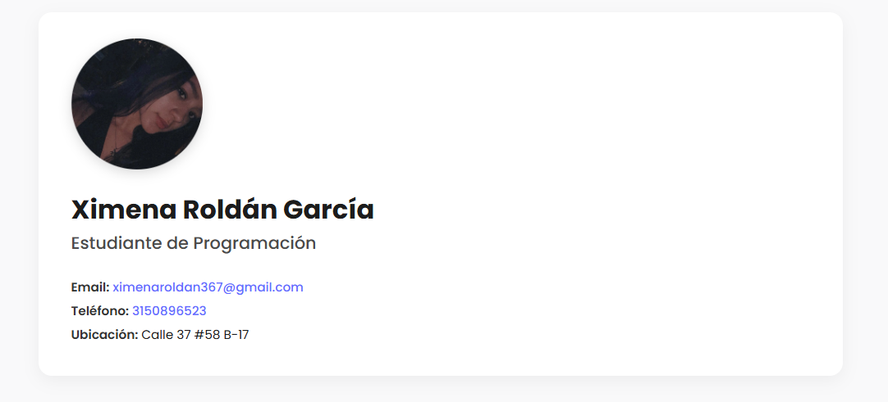
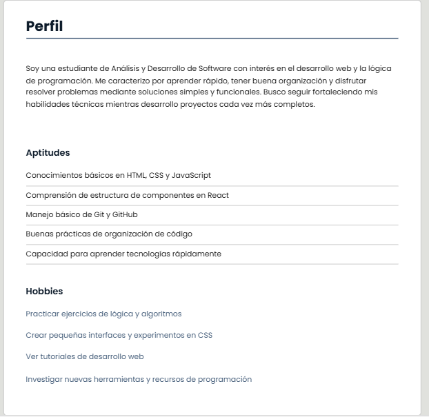
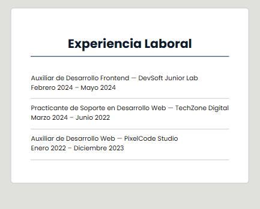
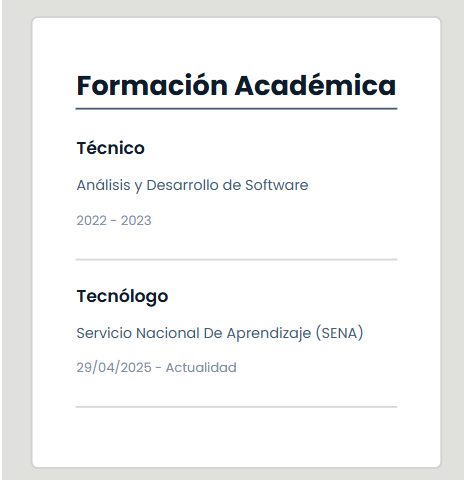

# Mi React Vite Ximena Roldan Garcia en React
# CV Ximena Roldan Garcia
Este proyecto es una aplicación React donde presento mi información personal, habilidades, estudios, tecnologias y experiencia.

Vista general del proyecto

# Instrucciones para ejecutar el proyecto

1. Clonar este repositorio:

En tu terminal usa el comando 
"git clone https://github.com/Ximena0405/cv-react-ximena.git

2. Configurar espacio para tu proyecto 
Entra a la carpeta he instala las dependencias con "cd nombre-proyecto". Luego instala las dependencias con "npm install", si trabajas con React.

3. Ejecuta tu proyecto
Usa "npm run dev" y ejecuta tu proyecto en el local host

# Historial de Commits y componentes

# Commits del 20 de Noviembre de 2025

* Inicio de carpeta y documentación con las dependencias de React y Vite
  8481e65

* feat: agrega componente Perfil y actualiza App  
  0030ba6

* feat: agregar componente Experiencia e integrarlo en App
  95536b8

# Commits del 21 de Noviembre de 2025

* feat: agregar componente estudios e integrarlo en App
  62c3f12

# Commits del 24 de Noviembre de 2025

* feat: componente StackTecnologias dinámico y con renderizado
  b77c698

* feat: actualizar estilos de cabecera para diseño más elegante y minimalista
92b4569

